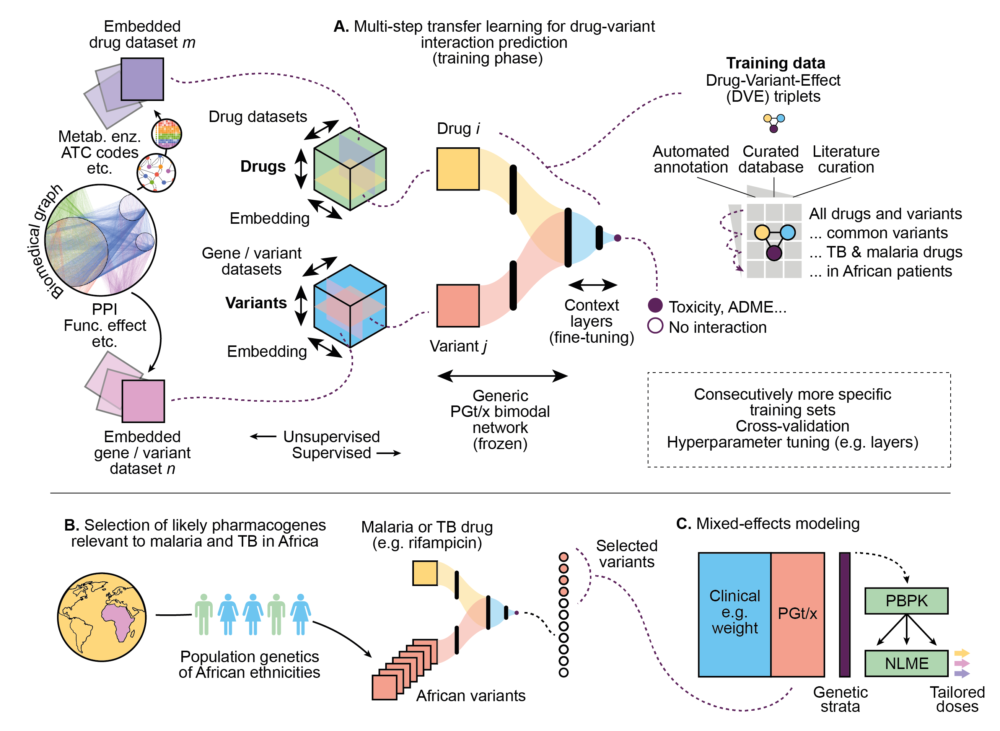

[](https://doi.org/10.5281/zenodo.16905958)

# PharmacoGx Embeddings

Use drug and gene embeddings to predict drug-gene interactions, with a focus on Africa.

## Project overview

This repository is related to the manuscript _AI coupled to pharmacometric modelling to tailor malaria and tuberculosis treatment in Africa_, co-led by the [H3D Centre](https://h3d.uct.ac.za/) (South Africa) and the [Ersilia Open Source Initiative](https://ersilia.io). Please read the [medRxiv preprint](https://www.medrxiv.org/content/10.1101/2024.11.07.24316884v1).

In brief, this computational work consists of two parts:
1. An ML/AI-based prioritisation of drug-pharmacogene pairs of potential relevance to African populations.
2. A pharmacometric modeling analysis of the prioritised pharmacogenes for malaria and tuberculosis drugs.

The current repository is focused on the first part, summarized in the following figure in panels A and B.



For more information:
- Check the [PharmacoGx-ARSA](https://github.com/ersilia-os/pharmacogx-arsa) repository for more details on the processing of 'African variants'.
- Find the app code in the [PharmacoGX-App](https://github.com/ersilia-os/pharmacogx-app) repository, or try the [online demo](https://pharmacogx-embeddings.streamlit.app/).
- Read our [comment in Nature](https://www.nature.com/articles/d41586-024-01001-y) about the launch of this project.
- To learn more about the GRADIENT projects, see this [article in Drug Discovery Today](https://www.sciencedirect.com/science/article/pii/S1359644624000643).

## Knowledge graph

The pipeline starts with the compilation of a knowledge graph, and the obtention of embeddings for drugs and genes to be used as predictive features.

The knowledge graph leverages mainly [PharmGKB](https://pharmgkb.org), the [Bioteque](https://bioteque.org) and the [Chemical Checker](https://bioactivitysignatures.org):
* **PharmGKB** is used as a source of pharmacogenomics knowledge. We use the different concepts summarized in PharmGKB as the backbones of the knowledge graph. These include, for example, evidence levels of the variant-drug relationships, or the biogeographical groups in which a variant has been identified.
* The **Bioteque** is a knowledge graph itself integrating relations between 12 biological entities, and describing them as ML-amenable descriptors. We use it to complement the knowledge graph with additional information.
* The **Chemical Checker** is an integrative approach to obtain bioactivity descriptors for small molecules, ranging from structural information to clinical data.

#### Curation of PharmGKB

Since PharmGKB is the major source of information for the KG, below we detail a few of the assumptions made during data curation and processing, to build the tables that can be found in the corresponding [folder](https://github.com/ersilia-os/pharmacogx-embeddings/tree/main/data/pharmgkb_processed). This is simply an overview of the data curation process, please refer to the code for more details.
* Chemicals: each chemical, belonging to a specific type (Drug, Metabolite, Small Molecule, Ion...) is associated to a chemical ID (cid, PharmGKB Accession ID), a name, and a SMILES. If the SMILES is not available, we discard the chemical for the current KG. The dosing guideline status (Yes: 1, No: 0) is also collected.
* Genes: each gene is associated to a gene ID (gid, PharmGKB Accession ID). For each gene, we define whether it is a VIP, has variants annotated or dosing guidelines (Yes: 1, No: 0)
* Variants: the variants table relates each variant, identified by its name and a variant ID, to the gene(s) where it belongs (gid).
* Haplotypes: haplotypes are identified in the relationships table from PharmGKB. We collect their ID, name, and associated gene(s).
* Diseases: diseases are listed from the phenotype files, indexed by ID (did, PharmGKB Accession ID) and name.
* PK phenotype: as defined by PharmGKB, pharmacokinetics phenotype can be Dosing, Metabolism/PK or Other. Relations without described phenotype are NaN.
* PD phenotype: as defined by PharmGKB, pharmacodynamics phenotype can be Efficacy, Toxicity, PD or Other. Relations without described phenotype are NaN.
* Evidence: the evidence levels indicate how reliable an association is. 0A: Actionable PGx (from drug labels), 0B: Informative PGx (from drug labels), 0C: Testing recommended (from drug labels), 0D: Testing required (from drug labels), 0E: VIP Gene, 0F: Pathway, 0G: Dosing Guideline, 1A, 1B, 2A, 2B, 3, 4: clinical annotations, 5A: variant_drug annotations, 5B: variant_phenotype annotations, 5C: variant_fa annotations, 6A: automated annotations, 6B: DataAnnotations, 6C: Literature, 6D: Multilink Annotations
* Biogeographical group: described in [PharmGKB](https://www.pharmgkb.org/page/biogeographicalGroups)

These tables are merged into the PGX relationship table. At this moment, the PGX mainly encompasses the following information: annotation ID (unique identifier of the relationship described), genomic variation (variant or haplotype) and its ID, gene and its ID, chemical and its ID, PK and PD phenotype, evidence level, association (significance of the association Yes: 1 / No: -1 / Inconclusive: 0) and biogeographical group.

## How to use this repository

### Install dependencies

We recommend that you create a Conda environment and then, simply install the Python requirements specified in the `requirements.txt` file.

```bash
conda create -n pgxemb python=3.10
conda activate pgxemb
pip install -e .
```

This will install the necessary requirements to run the pipelines in the `scripts` folder.

Note that, in addition, you will need an OpenAI API key if you are planning to run the LLM-related scripts. This API key is expected to be in a `.env` file in the current repository directory.

## Repository structure

* `assets`: some graphical assets for the project.
* `data`: contains all the `.csv` and `.tsv` files, including those directly downloaded from open repositories.
* `scripts`: contains `.py` scripts to analyse the data.
* `notebooks`: testing notebooks and examples.
* `src`: source code for the building of the KG. Code from here is used by the scripts in the `scripts` folder. This folder contains the main classes for the predictors, encoders, etc.
* `paper` and `paper_revision`: mainly contain executable notebooks and extra data to produce the article figures.

The main folder of interest is `scripts`. Please note that several folders will be generated when you run the pipeline below, including `embeddings`, `models` and `results` folders. Also, please note that the `data` folder will be modified slightly on-the-fly.

## Computational pipeline

The pipeline scripts are organized in folders (0–4) and, within each folder, they should be run in numerical order. Within a folder, script names starting with the same number can be run in any order or in parallel.

1. Run scripts in `scripts/0_process_pharmgkb` to process raw PharmGKB data into harmonized files.
2. Run scripts in `scripts/1_preparation` to prepare drug and gene embeddings and descriptors.
3. Run scripts in `scripts/2_pairs` to prepare training data, train models, and make exhaustive predictions.
4. Run scripts in `scripts/3_llm_assessment` to rerank drug-gene pair predictions based on large language models. Note that an OpenAI API key is necessary.
5. Run scripts in `scripts/4_post_analyses` to produce analyses on the results, including statistics and plots, and the PGx signature analysis based on topic modeling.

A folder containing all pre-calculated data is available for [download](https://drive.google.com/file/d/1fkQBdKVLR5WNsM8ALiFi_X71QtXhgnLe/view?usp=drive_link) (24GB).

Should you encounter any obstacle while running this code, please feel free to [open an issue](https://github.com/ersilia-os/pharmacogx-embeddings/issues). We'll address it as soon as possible.

The most important output of this pipeline is [this file](results/results_pairs/chemical_gene_pairs_prediction_output_focus_with_variant_aggregates_top50_filter_llm_top10.csv), which contains the results of the drug-gene ranking for the malaria and tuberculosis drugs of interest. In the `paper` and `paper_revision` folders, you will find the graphical assets obtained after running the pipeline.

## License

The code in this repository is licensed under a GNU General Public License v3.0. The data comes from public repositories and is limited to the licenses stated by the original data producers.

## About the Ersilia Open Source Initiative

The [Ersilia Open Source Initiative](https://ersilia.io) is a Non Profit Organization ([1192266](https://register-of-charities.charitycommission.gov.uk/charity-search/-/charity-details/5170657/full-print)) with the mission to equip labs, universities and clinics in LMIC with AI/ML tools for infectious disease research.

[Help us](https://www.ersilia.io/donate) achieve our mission or [volunteer](https://www.ersilia.io/volunteer) with us!
