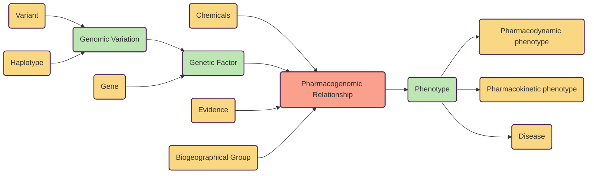

# PharmacoGx Embeddings
Calculate drug, gene, variant and disease graph embeddings based on pharmacogenomics knowledge.

## :construction: This is library is in continuous development and it is currently intended for internal use. We are currently working on it. Stay tuned! :construction: 

Real-time project progress will be tracked via [GitHub Projects](https://github.com/orgs/ersilia-os/projects/7/views/1).

> You can also check the [PharmacoGx-ARSA](https://github.com/ersilia-os/pharmacogx-arsa) repository for more details on the processing of 'African variants'.

## Project overview

## Knowledge graph

The knowledge graph leverages mainly [PharmGKB](https://pharmgkb.org) and the [Bioteque](https://bioteque.org):
* **PharmGKB** is used as a source of pharmacogenomics knowledge. We use the different concepts summarized in PharmGKB as the backbones of the knowledge graph. These include, for example, evidence levels of the variant-drug relationships, or the biogeographical groups in which a variant has been identified.
* The **Bioteque** is a knowledge graph itself integrating relations between 12 biological entities, and describing them as ML-amenable descriptors. We use it to complement the knowledge graph with additional information.

### Ontology

To capture the main pharmacogenomic relationships and concepts in our KG, we have adapted the structure of PharmGKB and the light-weight pharmacogenomics ontology ([PGxO](https://bmcbioinformatics.biomedcentral.com/articles/10.1186/s12859-019-2693-9)). The below graph illustrates the main concepts captured in the KG, as well as the edges that relate the different concepts.
The central piece of the KG is the pharmacogenomic relationship, which, ideally, is able to describe the phenotypic effect a variant has on a specific drug. This interactions can range from well-proven (evidence levels 0 to 3), annotated relations to automated literature searches. In Yellow, we depict the Base Tables, which build upon PharmGKB's database. In Green, we depict relationship tables we have built based on the Base tables. The PGX Relationship table draws from all of them to integrate the different concepts.

#### Curation of PharmGKB
Since PharmGKB is the major source of information for the KG, below we detail a few of the assumptions made during data curation and processing, to build the tables that can be found in the corresponding [folder](https://github.com/ersilia-os/pharmacogx-embeddings/tree/main/data/pharmgkb_processed). This is simply an overview of the data curation process, please refer to the code for more details.
* Chemicals: each chemical, belonging to a specific type (Drug, Metabolite, Small Molecule, Ion...) is associated to a chemical ID (cid, PharmGKB Accession ID), a name, and a SMILES. If the SMILEs is not available, we discard the chemical for the current KG. The dosing guideline status (Yes: 1, No: 0) is also collected.
* Genes: each gene is associated to a gene ID (gid, PharmGKB Accession ID). For each gene, we define whether it is a VIP, has variants annotated or dosing guidelines (Yes: 1, No: 0)
* Variants: the variants table relates each variant, identified by its name and a variant ID, to the gene(s) where it belongs (gid).
* Haplotypes: haplotypes are identified in the relationships table from PharmGKB. We collect their ID, name, and associated gene(s).
* Diseases: diseases are listed from the phenotype files, indexed by ID (did, PharmGKB Accession ID) and name.
* PK phenotype: as defined by PharmGKB, pharmacokinetics phenotype can be Dosing, Metabolism/PK or Other. Relations without described phenotype are Nan
* PD phenotype: as defined by PharmGKB, pharmacodynamics phenotype can be Efficacy, Toxicity, PD or Other. Relations without described phenotype are Nan
* Evidence: the evidence levels indicate how reliable an association is. 0A: Actionable PGx (from drug labels), 0B: Informative PGx (from drug labels), 0C: Testing recommended (from drug labels), 0D: Testing required (from drug labels), 0E: VIP Gene, 0F: Pathway, 0G: Dosing Guideline, 1A, 1B, 2A, 2B, 3, 4: clinical annotations, , 5A: variant_drug annotations, 5B: variant_phenotype annotations, 5C: variant_fa annotations, 6A: automated annotations, 6B: DataAnnotations, 6C: Literature, 6D: Multilink Annotations
* Biogeographical group: described in [PharmGKB](https://www.pharmgkb.org/page/biogeographicalGroups)

These tables are merged into the PGX relationship table. At this moment, the PGX mainly encompasses the following information: annotation ID (unique identifier of the relationship described), genomic variation (variant or haplotype) and its ID, gene and its ID, chemical and its ID, pk and pd phenotype, evidence level, association (significance of the association Yes: 1 / No: -1 / Inconclusive: 0) and biogeograhical group.

## Repository structure

* `assets`: graphical assets for the project
* `data`: contains all the .csv and .tsv files, including those directly downloaded from open repositories
* `scripts`: contains  .py scripts analyse the data
* `notebooks`: testing notebooks and examples
* `src`: source code for the building of the KG

Please note that, upon running the pipeline, the following folders will be created:
* `embedding_pairs` and/or `embedding_triplets`: embedding information as dataframes.
* `results_pairs` and/or `results_triplets`: results of prediction experiments.

## Experiment pipelines

### Phase 1: Drug-Gene pairs

* Input: **PharmGKB** drug-gene pairs.
* Output: All **pair-wise combinations** on **PharmGKB** genes and drugs.

#### Steps

1. Run scripts in `scripts/0_preparation`.
1. Run scripts in `scripts/1_pairs`.

### Phase 2: Drug-Variant-Gene triplets

* Input: **PharmGKB** drug-variant-gene triplets & **African variants**.
* Output: Prediction of **African drug-variants-gene triplets** of potential pharmacogenetic relevance.

#### Steps

1. Get **African variants**. Please see repository [pharmacogx-arsa](https://github.com/ersilia-os/pharmacogx-arsa).
1. Run scripts in `scripts/0_preparation`.
1. Run scripts in `scripts/1_triplets`.

## License
The code in this repository is licensed under a GNU General Public License v3.0. The data comes from public repositories and is limited to the licenses stated by the original data producers.

## About Us

The [Ersilia Open Source Initiative](https://ersilia.io) is a Non Profit Organization ([1192266](https://register-of-charities.charitycommission.gov.uk/charity-search/-/charity-details/5170657/full-print)) with the mission is to equip labs, universities and clinics in LMIC with AI/ML tools for infectious disease research.

[Help us](https://www.ersilia.io/donate) achieve our mission or [volunteer](https://www.ersilia.io/volunteer) with us!
